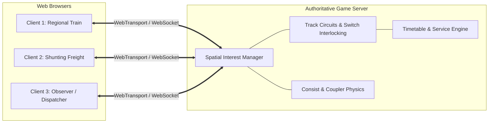

# Future Architecture & Implementation Roadmap

This document outlines the architectural blueprints, technical specifications, and implementation phases for future milestones: **Procedural World & Network Generation** and **Real-Time Multiplayer Simulation**.

---

## 1. Procedural World & Network Generation

### Objective

Replace the static track, station, crossing, and scenery definitions in [`src/track.ts`](file:///home/stefano/dev/rails/src/track.ts), [`src/stations.ts`](file:///home/stefano/dev/rails/src/stations.ts), and [`src/scenery.ts`](file:///home/stefano/dev/rails/src/scenery.ts) with a deterministic, seed-based procedural generation engine.

### Pipeline Stages

```mermaid
flowchart TD
    A[Seed Initialization (PRNG)] --> B[Macro Settlement & Topology Graph]
    B --> C[Spline Corridor & Geometry Smoothing]
    C --> D[Station Platforms & Turnout Crossovers]
    D --> E[Automatic Block Subdivision & Signal Synthesis]
    E --> F[Road Splines & Perpendicular Crossings]
    F --> G[Clearance Envelopes & Scenery Scatter]
```

### Technical Specifications

1. **Deterministic PRNG**:
   - Use a seeded PRNG (e.g. Mulberry32 or SplitMix32) so any generated world can be reproduced or shared via URL query string (`?seed=123456`).
2. **Settlement & Topology Graph**:
   - Sample station nodes using Poisson Disk Sampling within a configurable world bounding box ($W \times H$).
   - Build line topology using a Minimum Spanning Tree (MST) + Relative Neighborhood Graph (RNG) with stochastic cycle addition (forming mainline loops and branch sidings).
3. **Curvature & Track Geometry Constraints**:
   - Calculate minimum curve radius based on line design speed:
     $$R_{\min} \ge \frac{v_{\max}^2}{11.8 \cdot \text{cant}_{\max}} \approx 400\text{ m to } 800\text{ m}$$
   - Fit $C^2$ continuous splines (Catmull-Rom or cubic Béziers) ensuring curvature $\kappa \le 1 / R_{\min}$.
   - Generate parallel mainline tracks using normal offset vectors:
     $$\vec{p}_{\text{right}}(s) = \vec{p}_{\text{center}}(s) + \frac{d}{2} \hat{n}(s), \quad \vec{p}_{\text{left}}(s) = \vec{p}_{\text{center}}(s) - \frac{d}{2} \hat{n}(s)$$
     with realistic track spacing $d \approx 25\text{–}27\text{ m}$.
4. **Turnouts & Crossovers**:
   - Standard turnout angles: $1:9$ to $1:12$ ($6.3^\circ$ to $4.7^\circ$).
   - Place facing and trailing crossovers $300\text{–}500\text{ m}$ in advance of station approach throats.
5. **Signaling Generation Rules**:
   - Subdivide lines into blocks of length $L_{\text{block}} \approx 1000\text{–}1500\text{ m}$.
   - Place primary stop signals (`Hp`) at block boundaries facing oncoming traffic.
   - Place paired secondary distant signals (`Vr`) exactly $800\text{–}1000\text{ m}$ ahead of each primary signal.
   - Synchronize bidirectional line signaling using GWB rules (see [`src/signals.ts`](file:///home/stefano/dev/rails/src/signals.ts)).
6. **Crossings & Scenery Clearance**:
   - Generate secondary road splines. Crossings are only permitted on track segments where curvature $\kappa \approx 0$.
   - Enforce an exclusion zone ($25\text{ m}$ buffer from track centerlines and $40\text{ m}$ around station platforms) where scenery props (houses, trees) are prohibited from spawning.

---

## 2. Real-Time Multiplayer Web Architecture

### Objective

Transform the client-only simulation into a shared persistent multiplayer session where multiple players drive trains, perform shunting/depot maneuvers, obey authoritative signaling, and observe dynamic traffic.

### Architecture Overview



### Core Components

#### 1. 1D Track Coordinates & Dead Reckoning

- Because trains travel exclusively on pre-defined 1D spline manifolds, positions do not require continuous 2D/3D coordinate broadcasting.
- State vector per train consist:
  $$\text{State} = \{ \text{trainId}, \text{trackId}, s, v, a, \text{reverser} \}$$
  where $s$ is arc-length along the track in meters, $v$ is velocity ($\text{m/s}$), and $a$ is acceleration ($\text{m/s}^2$).
- Network updates are broadcast at $10\text{–}20\text{ Hz}$ or on state change (throttle/brake adjustment).
- Clients locally evaluate the exact position $\vec{P}(s)$ on the shared track spline, eliminating spatial jitter, rubber-banding, and drifting.
- Packet footprint: $\le 24\text{ bytes}$ per train per tick.

#### 2. Authoritative Interlocking & Route Booking

- Clients **never** alter switches or clear signals locally.
- A client requests a route; the server validates that:
  1. The target block is unoccupied (track circuit test).
  2. No opposing route is set (flank protection).
  3. Switches are aligned and locked.
- The server grants the route, sets switches, and promotes signal aspects from `Stop` to `Clear` / `ExpectStop`.
- Automatic Train Protection (ATP) / SPAD penalties are enforced server-side (forced emergency brake application if a train crosses a red signal).

#### 3. Shunting, Depots & Consist Coupling

- Model consists as a directed tree/chain of rolling stock units (`Locomotive`, `PassengerCoach`, `FreightWagon`).
- **Coupling Mechanics**:
  - When two uncoupled consists share the same `trackId`, face each other within buffer tolerance ($\Delta s \le 0.5\text{ m}$), and have low relative speed ($\Delta v \le 5\text{ km/h}$), buffer coupling triggers automatically or on manual command.
  - The server merges the consist graph, calculates the new combined mass, brake percentage, and total length, and broadcasts the updated consist topology.
- **Uncoupling**:
  - A player can decouple wagons at any coupling point, splitting the train into two independent physics entities.

#### 4. Spatial Interest Management

- Partition the world into a 2D spatial grid (e.g. $2000 \times 2000\text{ m}$ cells).
- Clients subscribe to their active cell plus adjacent cells.
- The server only replicates train updates, crossing animations, and prop events to clients within the visibility bubble, allowing thousands of concurrent trains across a large map.

#### 5. Recommended Network Stack

- **Transport**: WebTransport (over HTTP/3 QUIC) for low-latency unreliable datagrams (position packets) and reliable streams (interlock requests, chat, service assignments). WebSocket as fallback.
- **Serialization**: Binary packing with `MessagePack` or typed `ArrayBuffer` (`DataView`).
- **Server Runtime**:
  - Phase 1: Node.js / Bun with TypeScript to share spline math and train physics directly from [`src/train.ts`](file:///home/stefano/dev/rails/src/train.ts) and [`src/track.ts`](file:///home/stefano/dev/rails/src/track.ts).
  - Phase 2: High-concurrency Go or Rust backend if scaling to dedicated regional shards.

---

## 3. Suggested Implementation Phases

1. **Phase 1: Procedural Generation Prototype**
   - Implement a deterministic seeded PRNG module.
   - Build a graph generator producing a random double-track loop with 2–3 stations and realistic curves.
   - Dynamically place switches, signals, crossings, and scenery.
2. **Phase 2: Consist Coupling & Depot Physics (Single Player)**
   - Separate [`Train`](file:///home/stefano/dev/rails/src/train.ts) into individual coupled vehicle entities (`Locomotive`, `Wagon`).
   - Implement shunting speeds, buffer contact physics, and coupling/uncoupling UI controls.
   - Build sidings and depot spurs.
3. **Phase 3: Multiplayer Foundation**
   - Build a minimal headless authoritative server (Node.js/TypeScript).
   - Implement 1D spline replication for multiple player trains.
   - Add player nametags, basic lobby, and chat.
4. **Phase 4: Authoritative Signaling & Dispatching**
   - Migrate signal and switch ownership to the server.
   - Add route locking, automated dispatcher AI, and timetable services.
